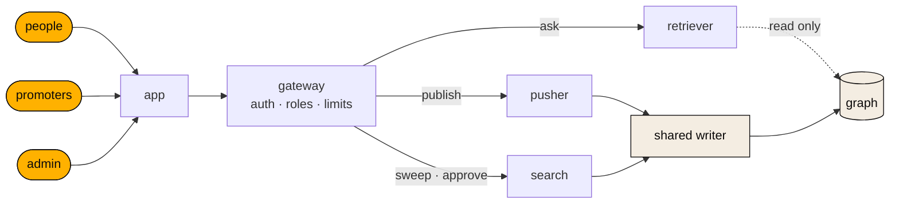
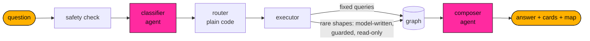
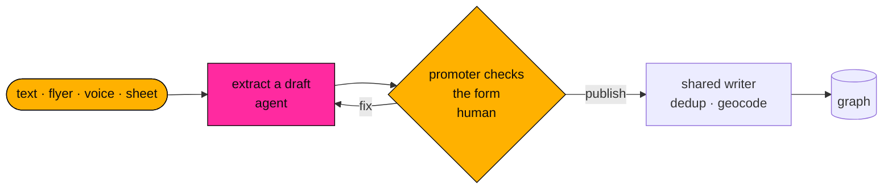
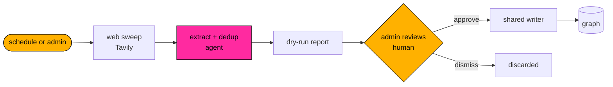

<p align="center">
  
</p>

<h1 align="center">LAIIVE</h1>

<p align="center"><i>Three rooms worth leaving the house for tonight.</i></p>

<p align="center">
  <a href="https://laiive.com">laiive.com</a> ·
</p>

---

#### what is laiive

laiive is what will save you from being at home scrolling for the rest of your life. laiive is where you find the perfect life event for you, and if you are an artist or a promoter is the way to make people know you are doing something. If you want to do something now, friday evening, saturday morning... Just ask, Laiive will help you to find what you are looking for outside of the screen.

#### why laiive is needed
laiive links the broken connection between events and public

#### laiive look for all, not just for the big ones
laiive was born to connect small events with people close to them, laiive does not focus on big musical events as many platforms are, laiive works on the human and community scale where small music events live.

#### laiive uses AI to balance our digital-physical culture.
laiive was born as an AI cultural agenda, with the AI hype and AI competition without the AI Safety layer laiive has become a subversive way of using AI, it tries to steal attention from the main digital platforms and bring it back to real world social meetings. laiive positions itself as an ethical AI app helping to develop a balanced digital-physical culture before the intermediate layer in our digital comunication becomes too powerful.

#### laiive has abitious positive outcomes
laiive is a catalyst of a worldwide demand that is actually unattended. laiive connects thousands of daily live events and millions of people are not going to them because they don't know they exist. Solving this gap may have a direct positive outcome, and many indirect ones, the most interesting one for our point of view, and because of the times that we are facing, is that laiive can enhance community strengths around physical cultural events, historically relevant focal points of resistance to authoritarianism.

#### why laiive is an AI safety project

It uses AI in a safe manner. It does not convince you, it does not manipulate you, it does not take over your life, it does not entertain you, it just automates mecanical decisions not human ones. It does not use your data to create any personal or cultural profile.

laiive uses AI to pull attention *away* from screens and back into shared physical rooms around music.

As AI systems grow more capable, more of how we meet, learn and decide passes through them. A
society whose ties exist only online depends on whoever runs that layer. Local, in-person culture
is the opposite: it holds when the platforms, the feeds or the models fail or turn against their
users. Rooms where people gather have always been focal points of civic life, and of resistance to concentration of power.

So laiive treats the civic layer as safety infrastructure. Every event it helps fill is a small
piece of ground-level resilience against the risks advanced AI and AGI bring: concentrated
control, manipulated attention, and people too isolated to act together. laiive is a project of
[ai safe earth](https://github.com/ai-safe-earth).

---

## Our commitments

What laiive promises its users, and holds itself to:

- **Time out, not time in.** laiive measures success by people in rooms, never by minutes in the
  app. No infinite feed, no streaks, no notifications designed to pull you back.
- **The AI answers; it does not invent.** Every event you see is a record from the graph. The
  model writes the words around the cards, never the cards themselves.
- **You see where it came from.** An event a promoter published is marked as theirs. An event
  found on the web is marked as web-sourced, with its source, and the organiser can claim it.
- **A human approves every write.** No AI output enters the event graph on its own — a promoter
  confirms their draft, an admin approves what the web sweep found.
- **Small rooms first.** Ranking never favours those who pay. There is no paid placement.
- **Minimal data.** Your browser carries the conversation; the server keeps no chat thread. We
  log each question and answer to measure quality, keep what your account needs, and sell
  nothing.
- **Honest about limits.** When laiive does not know, it says so and offers the next real option.

## AI safety validations

What the code actually enforces today:

| Risk | Control | Where |
| --- | --- | --- |
| Model-written database queries | Two locks: a regex guard rejects anything but reads, and the query runs in a read-only session | `retriever/agent/tools/safety_guard.py`, `clients/neo4j_client.py` |
| Prompt injection and harmful asks | Injection check and a moderation call before any model sees the message | `retriever/agent/pipeline.py` |
| Invented events | Common questions run as fixed, parameterised queries; the composer never lists events — cards come from the graph | `retriever/agent/router.py`, `composer.py` |
| AI writing to the graph unchecked | One write path for the whole system, gated by a human action; duplicates are rejected | `shared/laiive_shared/neo4j_writer.py` |
| Web data taken on trust | Web sweeps are dry runs until an admin approves each report | `services/search` |
| Unauthorised access | Signed login tokens with the role inside, per-role rate limits, and an internal key so no service is reachable except through the gateway | `services/gateway` |
| Silent regressions | Labelled eval cases for the safety guard and query shapes run in CI; a duplicate-detection set is under review | `retriever/evals`, `pusher/evals` |
| Opaque behaviour | Every model call in every service can be traced (Arize Phoenix) | `shared/laiive_shared/tracing.py` |

Known gaps, in the open: organiser verification is designed but not live, and duplicate detection
at entry still misses near-identical events. Both are on the roadmap.

---

## How it works

Four services and one shared contract. Only the gateway is public; the three Python services sit
on the internal network. Legend: <b>agent</b> = an AI model acts, <b>human</b> = a person decides,
<b>graph</b> = the event database (Neo4j).



### Retriever — answering a question



The classifier turns the question into constraints (place, time, price, genre, mood). Routing is
deterministic. The composer streams the answer word by word; the cards come straight from the
graph.

### Pusher — publishing an event



A listing with many events becomes a walk, one event per turn. A spreadsheet is a longer
conversation, not a batch upload.

### Search — sweeping the web



### Stack

| Part | What | Port |
| --- | --- | --- |
| `frontend/` | Vite + React + Tailwind. Chat is the app. Four languages (en/es/it/ca), voice input | — |
| `services/gateway` | Fastify + TypeScript. The only public surface | 8000 |
| `services/retriever` | FastAPI. Reads the graph, streams answers | 8002 |
| `services/pusher` | FastAPI. Turns promoter input into drafts, publishes on confirmation | 8003 |
| `services/search` | FastAPI + Prefect. Web sweeps into dry-run reports | 8004 |
| `services/shared` | `laiive-shared`: the typed stream protocol (with its TypeScript mirror) and the single graph write path | — |

Data lives in a Neo4j (Aura) graph of events, artists, venues, cities and genres. Accounts and
roles live in Supabase. Services run on Fly.io, the app on Cloudflare Pages.

---

## Running it

Every Python service is its own `uv` project — there is no root `pyproject.toml`, so every
command runs from inside a service directory. All of them read the single root `.env` (template:
`.example.env`), resolved relative to where you run them.

```bash
make up-dev            # whole stack in Docker: gateway, retriever, pusher, search, redis
make down

make start-gateway     # :8000, the only surface the app uses
make start-retriever   # :8002
make start-pusher      # :8003
make start-search      # :8004
cd frontend && npm install && npm run dev

make test-all          # mirrors CI: ruff + pytest per service, vitest for the gateway
```

Integration tests need a live graph and real keys; they are skipped by default.
Deploy: see [DEPLOY.md](DEPLOY.md).

---

## Contributing

laiive is a private product. Contributions come by invitation: if you want to help, open an issue
or write to the owner first. By submitting a contribution you agree that it becomes part of laiive
under the licence below, and that the copyright holder may use it without restriction.

### Branches

| branch | what it is |
| --- | --- |
| `main` | **Production.** Only `develop` merges into it, through a release PR. Protected: PR required, every check green, no force-push, no deletion. |
| `develop` | **The trunk.** Default branch; all work lands here. |
| `<type>/<kebab-desc>` | Short-lived work — `feat/…`, `fix/…`, `docs/…`, `chore/…`, `refactor/…`. Branch from `develop`, PR into `develop`. |

`legacy/pre-refactor` (also tag `pre-refactor-main`) and `experiment/k3s` are archives — never
build on them.

```
feat/…  ─┐
fix/…   ─┼─▶ develop ──(release PR)──▶ main ──▶ tag + deploy
hotfix/… ────────────────────────────▶ main, then merged back into develop
```

**Merge commits, never squash.** The commit bodies carry the reasoning; squashing flattens it.

### Commits

Conventional Commits, lowercase subject, checked by a `commit-msg` hook. The subject says
**what**, the body says **why** — what problem, what alternatives — and a `Refs: #123` trailer
links the issue.

```
fix(retriever): widen the near-me radius before giving up

Three cities returned nothing inside 2 km while the next venue sat at 2.4 km.
Widening in steps keeps the first answer local and still finds something.

Refs: #156
```

Code comments explain non-obvious decisions and known limits, not what the code already says. No
commented-out code, no TODO without context. Pre-commit hooks must pass.

### Releasing

1. **Deploy the services first, from `develop`** — `make fly-deploy-*` per `DEPLOY.md`. Fly
   deploys are manual and Cloudflare Pages builds `main` the moment the PR lands, so merging first
   would ship an app calling routes the old services do not have.
2. Open a PR `develop` → `main` titled `release: vX.Y.Z`. CI must be green.
3. Merge it with a merge commit.
4. On `main`, run `make release`: `cz bump` reads the commits since the last tag, picks the version,
   writes `CHANGELOG.md`, commits and tags. Push the commit and the tag.
5. Merge `main` back into `develop` — **locally, never as a PR with `main` as the head branch**:

   ```
   git fetch origin && git checkout develop && git pull --ff-only origin develop
   git merge origin/main && git push origin develop
   ```

   The repo deletes head branches on merge and the owner's role bypasses the protection, so such a
   PR deletes production's branch. PR #66 did exactly that on 2026-08-23.

**Hotfixes:** branch from `main`, PR into `main`, release as above, then merge `main` into
`develop` in the same sitting.

### Respect

Be kind. Assume good intent. Disagree with ideas, not people.

---

## Licence

Proprietary. Copyright © 2026 Oscar Arroyo Vega. All rights reserved. See [LICENSE](LICENSE).
Third-party components keep their own licences; see [THIRD_PARTY_NOTICES.md](THIRD_PARTY_NOTICES.md).
